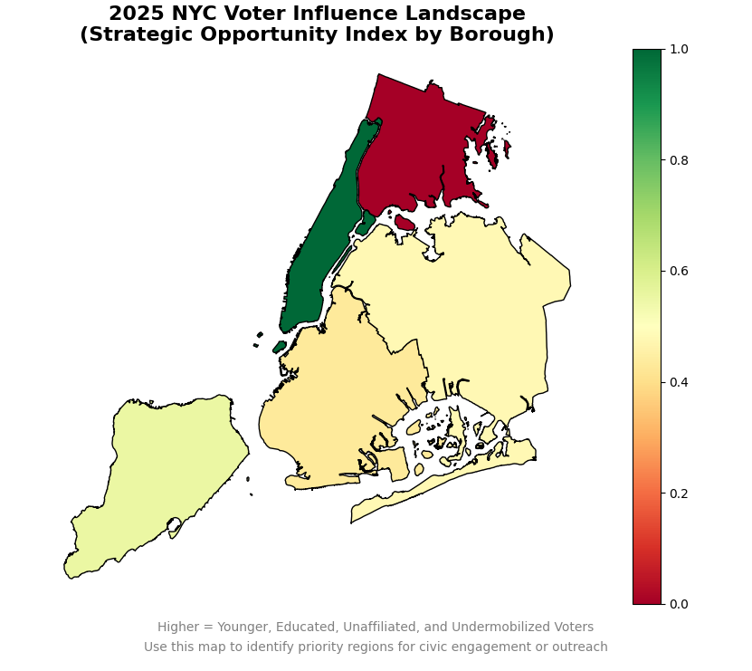

# MapTheVoteNYC2025: Strategic Voting Landscape Tool

A data-driven tool to visualize and identify high-impact voter engagement zones across NYC.  
Built to support civic action, outreach strategy, and increase turnout in the 2025 mayoral election.



---

## I What It Does

- Maps voter demographics like age, education, and unaffiliated status
- Calculates a **Strategic Engagement Index** by borough (scaled 0.0 to 1.0)
- Visualizes opportunity using a red–green heatmap
- Helps campaigns, nonprofits, and communities focus efforts where it matters

---

## II What the 0–1.0 Score Means

Each NYC borough is scored from **0 (low potential)** to **1.0 (high strategic potential)** for civic engagement based on:
- % under age 30
- % unaffiliated voters
- % college-educated
- Turnout rate
- Median income (scaling factor)

This creates a composite “engagement opportunity” score.

---

## III Sources Used

Real borough-level metrics were sourced from:

- NYC Board of Elections turnout stats: [https://vote.nyc](https://vote.nyc/)
- Furman Center income/education data: [https://furmancenter.org](https://furmancenter.org)
- NYU Civic Engagement reports (2022–2024)
- NYC Planning Population Facts: [https://www.nyc.gov/site/planning](https://www.nyc.gov/site/planning)
- Open Civic Data via NYC Open Data Portal: [https://opendata.cityofnewyork.us/](https://opendata.cityofnewyork.us/)

> Data is estimated from 2021–2024 trends and will be refined as new datasets become available.

---

## IV Run It Locally

```bash
git clone https://github.com/kosausrk/MapTheVote2025.git
cd MapTheVote2025
git checkout -b refine
python3 -m venv civicenv && source civicenv/bin/activate
pip install -r requirements.txt
python main.py
